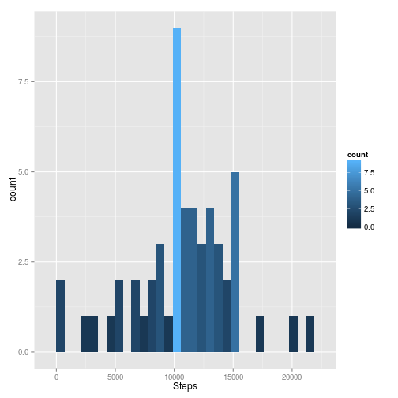
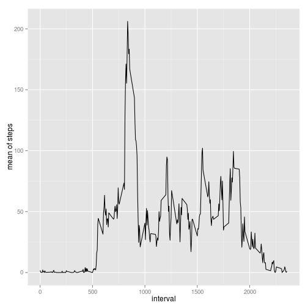
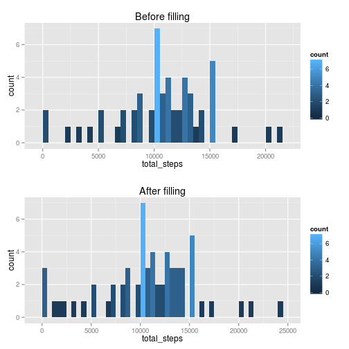
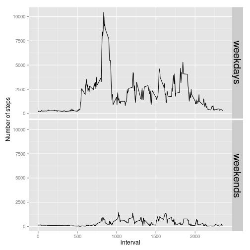

# Reproducible Research: Peer Assessment 1

## Loading library

```r
library(data.table)
library(fasttime)
library(ggplot2)
library(gridExtra)
```

```
## Loading required package: grid
```

## Getting data

```r
if (!file.exists('activity.csv')) unzip("activity.zip")
```

## Loading and preprocessing the data

```r
testData <- fread("activity.csv",nrows=1000)
summary(testData)
```

```
##      steps           date              interval   
##  Min.   :  0.0   Length:1000        Min.   :   0  
##  1st Qu.:  0.0   Class :character   1st Qu.: 510  
##  Median :  0.0   Mode  :character   Median :1022  
##  Mean   : 24.7                      Mean   :1091  
##  3rd Qu.:  0.0                      3rd Qu.:1700  
##  Max.   :613.0                      Max.   :2355  
##  NA's   :288
```

```r
head(testData)
```

```
##    steps       date interval
## 1:    NA 2012-10-01        0
## 2:    NA 2012-10-01        5
## 3:    NA 2012-10-01       10
## 4:    NA 2012-10-01       15
## 5:    NA 2012-10-01       20
## 6:    NA 2012-10-01       25
```

```r
testData$date <- fasttime::fastPOSIXct(testData$date)
summary(testData$date)
```

```
##                  Min.               1st Qu.                Median 
## "2012-10-01 00:00:00" "2012-10-01 00:00:00" "2012-10-02 00:00:00" 
##                  Mean               3rd Qu.                  Max. 
## "2012-10-02 06:31:40" "2012-10-03 00:00:00" "2012-10-04 00:00:00"
```

```r
data <- fread("activity.csv")
data$date <- fasttime::fastPOSIXct(data$date)
summary(data)
```

```
##      steps            date               interval   
##  Min.   :  0.0   Min.   :2012-10-01   Min.   :   0  
##  1st Qu.:  0.0   1st Qu.:2012-10-16   1st Qu.: 589  
##  Median :  0.0   Median :2012-10-31   Median :1178  
##  Mean   : 37.4   Mean   :2012-10-31   Mean   :1178  
##  3rd Qu.: 12.0   3rd Qu.:2012-11-15   3rd Qu.:1766  
##  Max.   :806.0   Max.   :2012-11-30   Max.   :2355  
##  NA's   :2304
```

```r
orgData <- data
data <- na.omit(data) #Ommited missing value
```


## What is mean total number of steps taken per day?
### A histogram of the total number of steps taken each day

```r
obsGroupByPerDay = orgData[,list(total_steps=sum(steps)),by=date] #NEED: V1 column name -> MeanOfSteps
p <- ggplot(data=obsGroupByPerDay) + geom_histogram(aes(x=total_steps,fill=..count..)) +
  xlab("Steps")
print(p)
```

```
## stat_bin: binwidth defaulted to range/30. Use 'binwidth = x' to adjust this.
```

 

### The mean total number of steps taken per day

```r
meanStepsPerDay = orgData[,mean(steps),by=date]
meanStepsPerDay
```

```
##           date      V1
##  1: 2012-10-01      NA
##  2: 2012-10-02  0.4375
##  3: 2012-10-03 39.4167
##  4: 2012-10-04 42.0694
##  5: 2012-10-05 46.1597
##  6: 2012-10-06 53.5417
##  7: 2012-10-07 38.2465
##  8: 2012-10-08      NA
##  9: 2012-10-09 44.4826
## 10: 2012-10-10 34.3750
## 11: 2012-10-11 35.7778
## 12: 2012-10-12 60.3542
## 13: 2012-10-13 43.1458
## 14: 2012-10-14 52.4236
## 15: 2012-10-15 35.2049
## 16: 2012-10-16 52.3750
## 17: 2012-10-17 46.7083
## 18: 2012-10-18 34.9167
## 19: 2012-10-19 41.0729
## 20: 2012-10-20 36.0938
## 21: 2012-10-21 30.6285
## 22: 2012-10-22 46.7361
## 23: 2012-10-23 30.9653
## 24: 2012-10-24 29.0104
## 25: 2012-10-25  8.6528
## 26: 2012-10-26 23.5347
## 27: 2012-10-27 35.1354
## 28: 2012-10-28 39.7847
## 29: 2012-10-29 17.4236
## 30: 2012-10-30 34.0938
## 31: 2012-10-31 53.5208
## 32: 2012-11-01      NA
## 33: 2012-11-02 36.8056
## 34: 2012-11-03 36.7049
## 35: 2012-11-04      NA
## 36: 2012-11-05 36.2465
## 37: 2012-11-06 28.9375
## 38: 2012-11-07 44.7326
## 39: 2012-11-08 11.1771
## 40: 2012-11-09      NA
## 41: 2012-11-10      NA
## 42: 2012-11-11 43.7778
## 43: 2012-11-12 37.3785
## 44: 2012-11-13 25.4722
## 45: 2012-11-14      NA
## 46: 2012-11-15  0.1424
## 47: 2012-11-16 18.8924
## 48: 2012-11-17 49.7882
## 49: 2012-11-18 52.4653
## 50: 2012-11-19 30.6979
## 51: 2012-11-20 15.5278
## 52: 2012-11-21 44.3993
## 53: 2012-11-22 70.9271
## 54: 2012-11-23 73.5903
## 55: 2012-11-24 50.2708
## 56: 2012-11-25 41.0903
## 57: 2012-11-26 38.7569
## 58: 2012-11-27 47.3819
## 59: 2012-11-28 35.3576
## 60: 2012-11-29 24.4688
## 61: 2012-11-30      NA
##           date      V1
```

### The median total number of steps taken per day

```r
medianStepsPerDay = data[,median(steps,na.rm=T),by=date]
medianStepsPerDay
```

```
##           date V1
##  1: 2012-10-02  0
##  2: 2012-10-03  0
##  3: 2012-10-04  0
##  4: 2012-10-05  0
##  5: 2012-10-06  0
##  6: 2012-10-07  0
##  7: 2012-10-09  0
##  8: 2012-10-10  0
##  9: 2012-10-11  0
## 10: 2012-10-12  0
## 11: 2012-10-13  0
## 12: 2012-10-14  0
## 13: 2012-10-15  0
## 14: 2012-10-16  0
## 15: 2012-10-17  0
## 16: 2012-10-18  0
## 17: 2012-10-19  0
## 18: 2012-10-20  0
## 19: 2012-10-21  0
## 20: 2012-10-22  0
## 21: 2012-10-23  0
## 22: 2012-10-24  0
## 23: 2012-10-25  0
## 24: 2012-10-26  0
## 25: 2012-10-27  0
## 26: 2012-10-28  0
## 27: 2012-10-29  0
## 28: 2012-10-30  0
## 29: 2012-10-31  0
## 30: 2012-11-02  0
## 31: 2012-11-03  0
## 32: 2012-11-05  0
## 33: 2012-11-06  0
## 34: 2012-11-07  0
## 35: 2012-11-08  0
## 36: 2012-11-11  0
## 37: 2012-11-12  0
## 38: 2012-11-13  0
## 39: 2012-11-15  0
## 40: 2012-11-16  0
## 41: 2012-11-17  0
## 42: 2012-11-18  0
## 43: 2012-11-19  0
## 44: 2012-11-20  0
## 45: 2012-11-21  0
## 46: 2012-11-22  0
## 47: 2012-11-23  0
## 48: 2012-11-24  0
## 49: 2012-11-25  0
## 50: 2012-11-26  0
## 51: 2012-11-27  0
## 52: 2012-11-28  0
## 53: 2012-11-29  0
##           date V1
```

## What is the average daily activity pattern?
### A time series plot (i.e. type = "l") of the 5-minute interval (x-axis) and the average number of steps taken, averaged across all days (y-axis)

```r
meanStepByInterval = data[,mean(steps),by=interval]
ggplot(data=meanStepByInterval) + geom_line(aes(x=interval,y=V1)) + ylab("mean of steps")
```

 

### 5-minute interval contains the maximum number of steps

```r
meanStepByInterval$interval[which.max(meanStepByInterval$V1)]
```

```
## [1] 835
```

```r
835/60 # At 2pm
```

```
## [1] 13.92
```

## Imputing missing values
### the total number of missing values
#### Per day

```r
orgData[,list(count=sum(is.na(steps))),by=date][count>0]
```

```
##          date count
## 1: 2012-10-01   288
## 2: 2012-10-08   288
## 3: 2012-11-01   288
## 4: 2012-11-04   288
## 5: 2012-11-09   288
## 6: 2012-11-10   288
## 7: 2012-11-14   288
## 8: 2012-11-30   288
```
#### All day

```r
summary(orgData) # 2304
```

```
##      steps            date               interval   
##  Min.   :  0.0   Min.   :2012-10-01   Min.   :   0  
##  1st Qu.:  0.0   1st Qu.:2012-10-16   1st Qu.: 589  
##  Median :  0.0   Median :2012-10-31   Median :1178  
##  Mean   : 37.4   Mean   :2012-10-31   Mean   :1178  
##  3rd Qu.: 12.0   3rd Qu.:2012-11-15   3rd Qu.:1766  
##  Max.   :806.0   Max.   :2012-11-30   Max.   :2355  
##  NA's   :2304
```

### Filling in all of the missing values in the dataset
#### Filling missing intervals in a day
*Strategy: Use steps' mean of a day to fill missing values of step that day*

```r
fillMissingIntervalInADayData = orgData
naPostition = which(is.na(fillMissingIntervalInADayData$steps))
naFilled = merge(fillMissingIntervalInADayData[naPostition,list(date)],medianStepsPerDay,by="date",all.x=TRUE) #Merge with median per day
fillMissingIntervalInADayData$steps[naPostition] = naFilled$V1
summary(fillMissingIntervalInADayData) # 2304
```

```
##      steps            date               interval   
##  Min.   :  0.0   Min.   :2012-10-01   Min.   :   0  
##  1st Qu.:  0.0   1st Qu.:2012-10-16   1st Qu.: 589  
##  Median :  0.0   Median :2012-10-31   Median :1178  
##  Mean   : 37.4   Mean   :2012-10-31   Mean   :1178  
##  3rd Qu.: 12.0   3rd Qu.:2012-11-15   3rd Qu.:1766  
##  Max.   :806.0   Max.   :2012-11-30   Max.   :2355  
##  NA's   :2304
```

#### Filling a day which have missing intervals
*Strategy: Use mean of steps group by intervals to fill missing values of steps belong to the intervals*

```r
#Duplicate data
fillADayMissingInvervals = fillMissingIntervalInADayData
#Find NA row position
naPostition = which(is.na(fillADayMissingInvervals$steps))
#Filled NA by interval
naFilledValues = merge(fillADayMissingInvervals[naPostition,list(interval)],meanStepByInterval,by="interval",all.x=TRUE)
#Assign back
fillADayMissingInvervals$steps[naPostition] = naFilledValues$V1
summary(fillADayMissingInvervals)
```

```
##      steps            date               interval   
##  Min.   :  0.0   Min.   :2012-10-01   Min.   :   0  
##  1st Qu.:  0.0   1st Qu.:2012-10-16   1st Qu.: 589  
##  Median :  0.0   Median :2012-10-31   Median :1178  
##  Mean   : 37.4   Mean   :2012-10-31   Mean   :1178  
##  3rd Qu.: 27.0   3rd Qu.:2012-11-15   3rd Qu.:1766  
##  Max.   :806.0   Max.   :2012-11-30   Max.   :2355
```
### A new dataset that is equal to the original dataset but with the missing data filled in.

```r
filledData = fillADayMissingInvervals
```

### Compare before and after filling missing values

```r
totalStepEachDay = filledData[,list(total_steps=sum(steps)),by=date]
before = ggplot(data=obsGroupByPerDay) + 
  geom_histogram(aes(x=total_steps,fill=..count..),binwidth=500) + 
  ggtitle("Before filling")
after = ggplot(data=totalStepEachDay) + 
  geom_histogram(aes(total_steps,fill=..count..),binwidth=500) + 
  ggtitle("After filling")
grid.arrange(before,after)
```

 
*Don't see much difference here*

## Are there differences in activity patterns between weekdays and weekends?
1. Create dayTypes variable indicate day as weekends or weekdays

```r
filledData$dayTypes = as.factor(filledData[,grepl("Sunday|Staturday",weekdays(date))])
levels(filledData$dayTypes) <- c("weekdays","weekends")
```
2. Make panel plot show number of steps for each interval split by dayTypes

```r
filledDataSumStepByDayTypesAndInterval = filledData[,list(sum=sum(steps)),by=list(dayTypes,interval)]
ggplot(data=filledDataSumStepByDayTypesAndInterval) +
  geom_line(aes(x=interval,y=sum)) +
  facet_grid(dayTypes ~ . ) +
  theme(strip.text.y = element_text(size = 20)) +
  ylab("Number of steps")
```

 
*Yes much difference, seem lazier at weekends*
